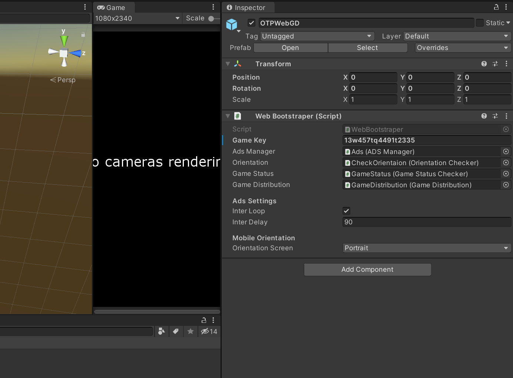
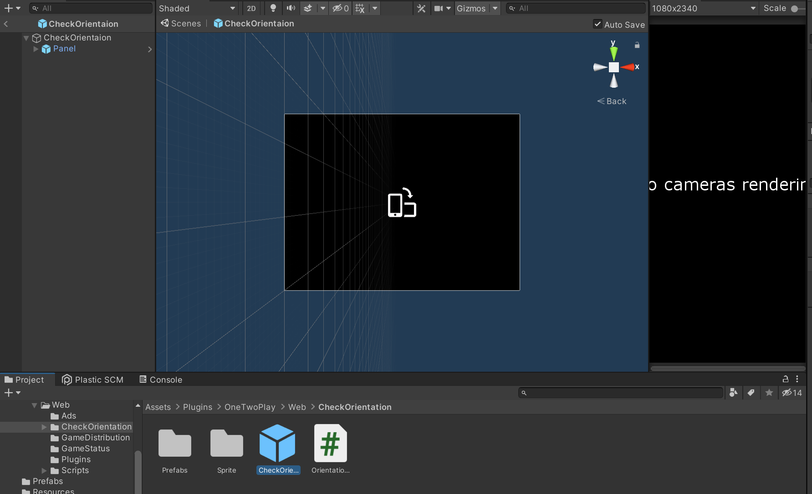
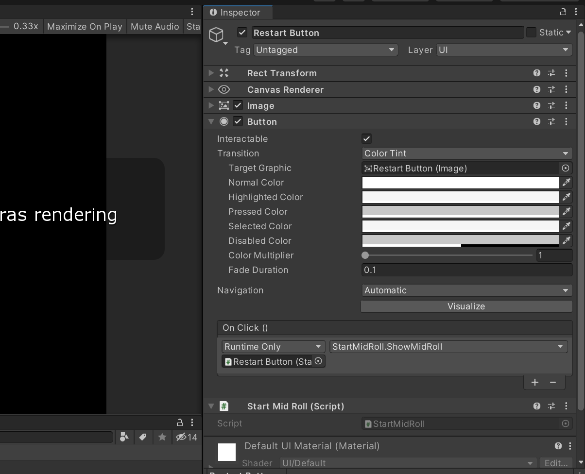
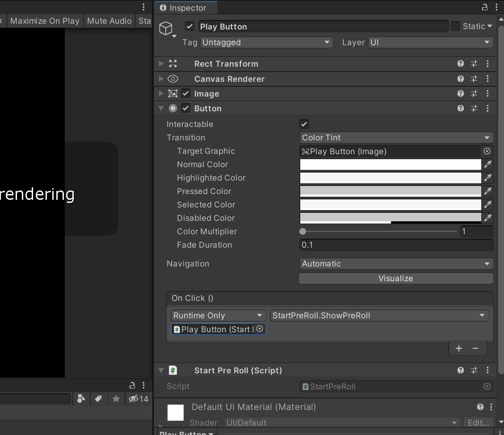
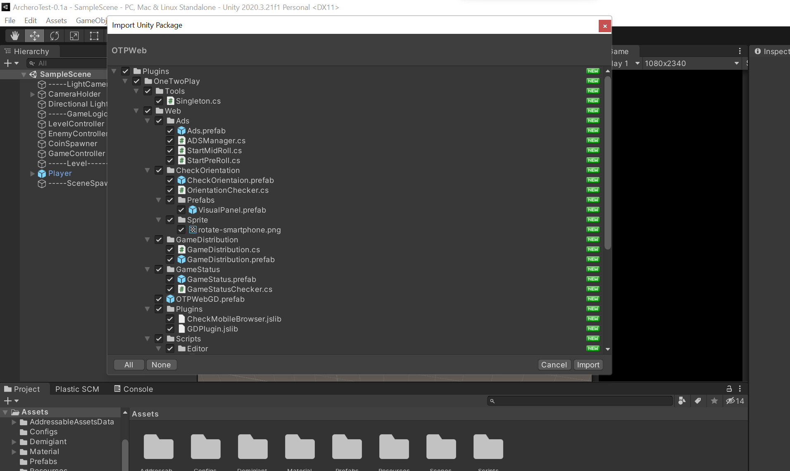
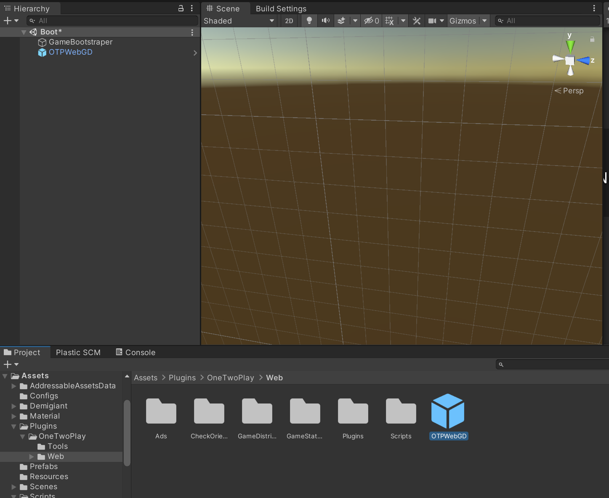

# OTPWeb
Troubleshooting WebGL builds on Unity. This SDK contains a set of solutions for quick and easy assembly of projects for WebGL on Unity.

The SDK contains:
1. AdsManager
2. CheckOrientation
3. GameStatus
4. GameDistribution

## **GameDistribution**
 This is [GameDistribution SDK for Unity](https://github.com/GameDistribution/gd-sdk-unity) with some changes.

## **GameStatus**
Stops the game when the tab is inactive or a GameDistribution ad is playing. Depends on GameDistribution.
## **CheckOrientation**
In the prefab "OTPWebGD" there is a field with a choice of the main orientation of the game for mobile devices. If the orientation of the user does not match the option you specified, he will see a window with a design to flip the device.

You can customize the window by changing the **`CheckOrientaion`** prefab located in **`Assets/Plugins/OneTwoPlay/Web/CheckOrientation/CheckOrientaion.prefab`**

## **AdsManager**
To check if a reward ad is ready, call the `ADSManager.Instance.RewardLoaded` property.
`Reward` - To call, use **`ADSManager.Instance.ShowReward(action)`**, where action is the method to be called in case of successful ad viewing. 

`Mid-roll` - 2 ways to launch: 
1. manual - **`ADSManager.Instance.ShowInter()`** for example after level completion. Alternatively, add, for example, the `StartMidRoll` component to the level restart button and call it by pressing `ShowMidRoll`. 

2. automatic - in the OTPWebGD prefab there is an InterLoop parameter, which every InterDelay (parameter below InterLoop) will run a Mid-roll.

`Pre-roll` -  ad block before gameplay. It can be executed only 1 time. There are 2 ways to start:
1. manual - **`ADSManager.Instance.ShowPreRoll()`** for example, for every button pressing the game starts. Or add, for example, the `StartPreRoll` component to the game start button and call `ShowPreRoll` by pressing it.

2. automatic - in the OTPWebGD prefab there is an InterLoop parameter, which will launch Pre-roll a second after the object is initialized

**If your game doesn't support showing ads after a certain period of time, don't forget to turn off `InterLoop` in the "OTPWebGD" prefab on your stage**

# Getting Started

**`Make sure you have installed WebGL in your version of Unity!`**
1. Download and import the .unitypackage into your game.

    .

    
2. Drag the prefab "OTPWebGD" into your scene.

    
3. Open the prefab and replace the GAME_KEY value with your own key from GameDistribution developer's control panel (in the 'Upload' tab).

    

